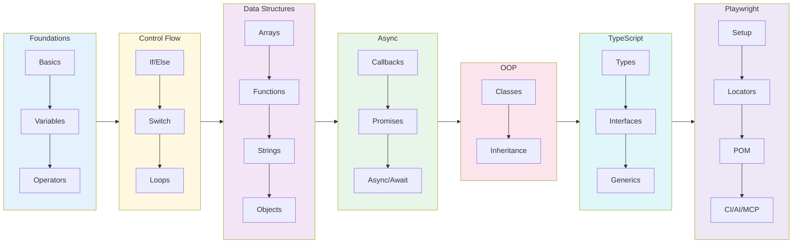
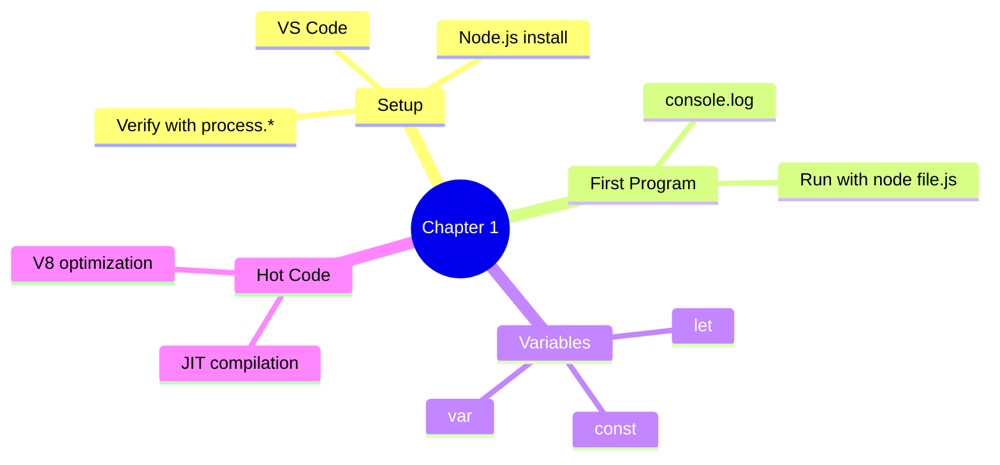
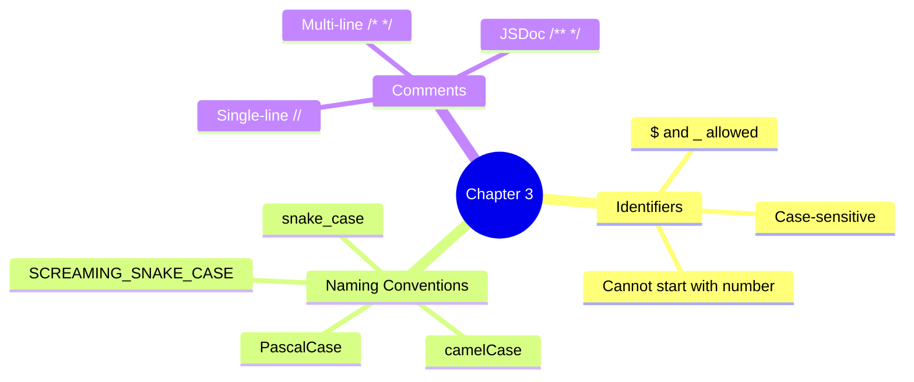
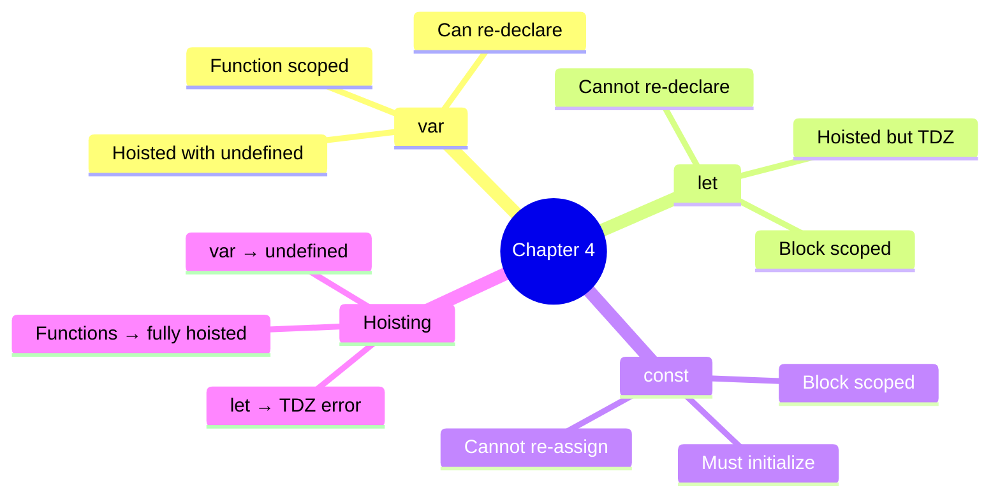
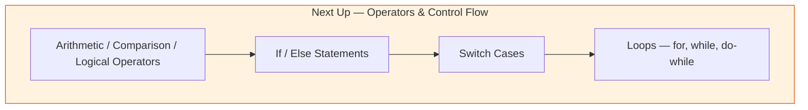
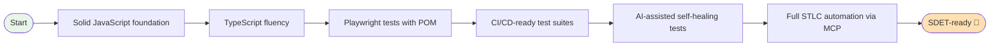
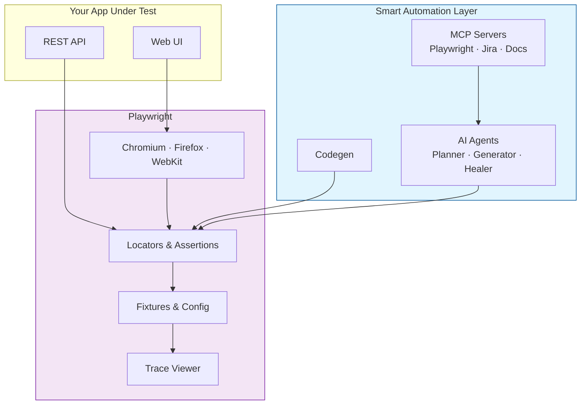

# Learn Playwright Batch 2x

<div align="center">


**The official course repository for Batch 2x — JavaScript, TypeScript, and Playwright for SDETs**

*Zero to automation hero — JavaScript fundamentals → TypeScript → Playwright → AI Agents & MCP*

[Quick Start](#-quick-start) · [Curriculum](#-curriculum-roadmap) · [Weekly Plan](#-weekly-plan) · [What You'll Build](#-what-youll-build) · [Resources](#-resources)

</div>

---

## Welcome to Batch 2x

This repository is your **week-by-week course companion** for the LearnPlaywright Batch 2x cohort by [The Testing Academy](https://thetestingacademy.com). Code shown in lectures lands here so you can read it, run it, and practice on it.

> Content gets added **as we progress through the batch** — so check back after every class.

### What you'll learn

- **JavaScript Fundamentals** — variables, control flow, arrays, functions, OOP, async
- **TypeScript** — types, interfaces, enums, generics, access modifiers, decorators
- **Playwright** — setup, locators, assertions, fixtures, POM, debugging, CI
- **Modern QA** — Playwright CLI, AI Agents, and MCP for full STLC automation

---

## 🆕 Recent Updates

- **Added Chapter 17: Promises** — Promise creation, resolve/reject patterns, `.then()`, `.catch()`, promise chaining, real API call examples.
- **Added Chapter 18: Async/Await** — Async functions, await keyword, error handling with try/catch, async patterns with API calls, real-world examples.
- **Added Chapter 15: 2D Arrays** (5 files) — 2D array creation, access, manipulation, functions with 2D arrays, and pattern-based problems.
- **Added Chapter 12: Functions** (22 files) — Function types, closures, higher-order functions, pure functions, arrow functions, IIFE, default parameters, rest parameters, and function scope.
- **Expanded Chapter 11: Arrays** (files 092–095) — Advanced array slicing, concatenation, and array checking methods.
- Added `chapter_10_loops/` with `for`, `while`, `do...while`, `for...of`, and loop practice examples.
- Added `chapter_11_arrays/` with array creation, access, transformation, and methods.
- Added `Chapter_12_fuctions/` with functions, closures, higher-order functions, arrow functions, rest parameters, spread, and scope.
- Added `Chapter_13_Strings/` with string methods, properties, searching, substring operations, and transformation examples.
- Added `package.json` and `pnpm-lock.yaml` for dependency and package management.
- Added `date.js` as a utility script.
- Added `.gitignore` to exclude local artifacts like `node_modules/` and `.commandcode/`.

---

## 🗺️ Curriculum Roadmap

```mermaid
graph TB
    subgraph root["LearnPlaywrightBatch2x"]
        direction TB

        subgraph js["📘 JavaScript (Weeks 1–6)"]
            ch1["Ch 1: Basics ✅"]
            ch2["Ch 2: JS Concepts ✅"]
            ch3["Ch 3: Identifiers & Literals ✅"]
            ch4["Ch 4: var / let / const & Hoisting ✅"]
            ch5["Ch 5: Operators ✅"]
            ch6["Ch 6: If / Else ✅"]
            ch7["Ch 7: Switch ✅"]
            ch8["Ch 8: Loops ✅"]
            ch9["Ch 9: Arrays ✅"]
            ch10["Ch 10: Functions ✅"]
            ch11["Ch 11: Strings ✅"]
            ch12["Ch 12: Functions ✅"]
            ch13["Ch 13: Strings ✅"]
        end

        subgraph adv["⚙️ Advanced JS (Weeks 7–8)"]
            adv1["Ch 12: Objects"]
            adv2["Ch 15: 2D Arrays ✅"]
            adv3["Ch 14: Callbacks"]
            adv4["Ch 17: Promises ✅"]
            adv5["Ch 18: Async / Await ✅"]
            adv6["Ch 19: OOP - Classes"]
            adv7["Ch 20: Inheritance"]
        end

        subgraph ts["🟦 TypeScript (Week 9)"]
            ts1["Ch 19: TS Fundamentals"]
            ts2["Ch 20: Interfaces"]
            ts3["Ch 21: Enums"]
            ts4["Ch 22: Generics"]
            ts5["Ch 23: Access Modifiers & Decorators"]
        end

        subgraph pw["🎭 Playwright (Weeks 10–12)"]
            pw1["Ch 24: PW Fundamentals"]
            cli["Lecture: Playwright CLI"]
            ai["Lecture: AI Agents"]
            mcp["Lecture: MCP Protocol"]
        end

        subgraph extras["🎯 Bonus"]
            tasks["Interview Coding Questions"]
            tests["Real-world Test Projects"]
        end
    end

    js --> adv --> ts --> pw --> extras

    style js fill:#e1f5fe,stroke:#01579b
    style adv fill:#fff3e0,stroke:#e65100
    style ts fill:#e0f7fa,stroke:#00838f
    style pw fill:#f3e5f5,stroke:#7b1fa2
    style extras fill:#e8f5e9,stroke:#2e7d32
```



---

## 📚 Current Folder Structure

```
LearnPlaywrightBatch2x/
├── chapter_01_Basics/                  ✅ Hello World, env setup, hot code
│   ├── 01_Basics.js                    # First console.log program
│   ├── 02_JS.js                        # Variables & a simple loop
│   ├── 03_JS_Verify_Setup.js           # Verify Node.js/OS/arch
│   └── 04_HotCode.js                   # JIT & "hot" code paths
│
├── chapter_02_Javascript_Concepts/     ✅ JS Basics
│   └── 05_JS_Basics.js                 # Variables & console output
│
├── chapter_03_Identifier_Literals/     ✅ Identifiers, literals & comments
│   ├── 06_Identifier_Rules.js          # Valid identifier names
│   ├── 07_Identifier_Part2.js          # Naming conventions (camelCase, PascalCase, snake_case)
│   ├── 08_Comments.js                  # Single-line & multi-line comments
│   ├── js_identifier_rules.js          # Identifier rules reference
│   ├── VS_Code_keyboard_shortcut_mac.md     # macOS VS Code shortcuts
│   └── VS_Code_keyboard_shortcut_windows.md # Windows VS Code shortcuts
│
├── chapter_04_Javascript_Concepts/     ✅ var / let / const & hoisting
│   ├── 09_var_let_const.js             # var, let, const basics
│   ├── 10_functions.js                 # Function declaration & calls
│   ├── 11_var_explained.js             # var deep dive
│   ├── 12_let_peope_love.js            # let deep dive
│   ├── 13_const_explained.js           # const deep dive
│   ├── 14_var_functionscope.js         # var function scope
│   ├── 15_let_scope.js                 # let block scope
│   ├── 16_Hoisting.js                  # Variable hoisting explained
│   └── 17_hoisting_fn.js               # Function hoisting
│
├── chapter_05_literals/                ✅ Literals & template strings
│   └── [022–029_literals.js]           # Number, string, null, undefined, template literals
│
├── chapter_06_operator/                ✅ Operators (arithmetic, comparison, logical)
│   └── [030–047_operators.js]          # All operator types & operator precedence
│
├── chapter_07_if_else/                 ✅ Conditional statements
│   └── [048–057_if_else.js]            # If/else logic with real-world examples
│
├── chapter_08_switch/                  ✅ Switch statements
│   └── [059–067_switch.js]             # Switch cases, break, default
│
├── chapter_09_userInput/               ✅ Reading user input
│   ├── 068_User_Input.js               # prompt-sync, readline modules
│   ├── 069_node_readline.js            # Node.js readline module
│   └── 070_prompt_sync.js              # prompt-sync for input
│
├── chapter_10_loops/                   ✅ Loop constructs
│   ├── [071–082_loops.js]              # for, while, do...while, for...of, for...in
│   └── [IQ1–IQ4_loops.js]              # Interview questions on loops
│
├── chapter_11_arrays/                  ✅ Arrays & array methods
│   ├── [084–087_arrays.js]             # Array creation, access, adding, removing elements
│   ├── 092_array.js                    # Advanced array operations
│   ├── 093_array_slicing.js            # Array slice & splice methods
│   ├── 094_concat_Array.js             # Array concatenation
│   └── 095_array_checking.js           # Array checking methods (isArray, etc.)
│
├── Chapter_12_fuctions/                ✅ Functions (types, closures, higher-order)
│   ├── 096_functions.js                # Function basics
│   ├── 097_type1_basic_functions.js    # Type 1: Basic function declaration
│   ├── 098_type2_function_with_Param_no_return.js  # Type 2: With parameters, no return
│   ├── 099_type3_function_without_param_NoReturn.js # Type 3: No parameters, no return
│   ├── 100_function_withParam_withreturn.js # Type 4: Parameters with return
│   ├── 101_Temple_literal.js           # Template literals in functions
│   ├── 102_fn_expression.js            # Function expressions
│   ├── 103_arrow_fn.js                 # Arrow function basics
│   ├── 104_arrow_real.js               # Arrow function applications
│   ├── 105_IIFE.js                     # Immediately Invoked Function Expressions
│   ├── 106_defaultParam_fn.js          # Default function parameters
│   ├── 107_Iq.js                       # Function interview questions
│   ├── 108_restParam.js                # Rest parameters (...args)
│   ├── 109_IQ.js                       # Rest parameter interview questions
│   ├── 110_speadIQ.js                  # Spread operator interview questions
│   ├── 111_scope_fn.js                 # Function scope & lexical scope
│   ├── 112_IQ.js                       # Scope interview questions
│   ├── 113_closure.js                  # Closures explained
│   ├── 114_closure.js                  # More closure examples
│   ├── 115_API_Real_closure.js         # Real-world closure usage
│   ├── 116_highOrder_fn.js             # Higher-order functions
│   └── 117_pure_fn.js                  # Pure functions
│
├── Chapter_13_Strings/                ✅ Strings, string methods, substring, and transform examples
│   ├── 118_strings.js                 # String basics
│   ├── 119_string_properties.js       # String properties
│   ├── 120_search_check_str.js        # Search and string checking
│   ├── 121_substring.js               # substring methods
│   ├── 122_transform_string.js        # Case transformation and formatting
│   └── 123_sc.js                      # String utilities and examples
│
├── chapter_15_2D_Array/               ✅ 2D Arrays & multi-dimensional data structures
│   ├── 138_2D_array.js                # 2D array creation & access
│   ├── 139_2D.js                      # 2D array manipulation
│   ├── 140_Real.js                    # Real-world 2D array use cases
│   ├── 141_2D_array-fn.js             # Functions with 2D arrays
│   └── 142_IQ-right-Pattern_py.js     # 2D array pattern problems
│
└── README.md                           👋 You are here
```

> **Legend:** ✅ Done · 🚧 Coming soon

---

## 🚀 Quick Start

### Prerequisites

| Tool | Version | Purpose |
|------|---------|---------|
| **Node.js** | 18+ (LTS recommended) | Runs all `.js` files |
| **npm** | Bundled with Node | Package manager |
| **VS Code** | Latest | Recommended editor |
| **Git** | Latest | Clone the repo |

### Setup

```bash
# 1. Clone the repository
git clone https://github.com/PramodDutta/LearnPlaywrightBatch2x.git
cd LearnPlaywrightBatch2x

# 2. Verify your setup
node chapter_01_Basics/03_JS_Verify_Setup.js

# 3. Run your first JS program
node chapter_01_Basics/01_Basics.js
```

### Verify it works

```bash
$ node chapter_01_Basics/01_Basics.js
Hello The Testing Academy
```

If you see that line, you're all set! 🎉

---

## 📅 Weekly Plan


| Week | Topic | Chapters | Outcome |
|:----:|-------|---------:|---------|
| 1 | JS Basics & Setup | Ch 1 | Run Node, write first JS |
| 2 | Variables & Hoisting | Ch 2–4 | Master `var`/`let`/`const` |
| 3 | Identifiers, Literals, Operators | Ch 5–6 | Read/write any expression |
| 4 | Control Flow | Ch 7–9 | If/else, switch, loops ✅ |
| 5 | Arrays & Functions | Ch 10–11 ✅ | Manipulate data, write functions |
| 6 | Strings & Objects | Ch 12–13 | Use JS data structures |
| 7 | Async (Callbacks → Promises) | Ch 14–16 | Handle async work |
| 8 | Async/Await + OOP | Ch 17–19 | Modern async, classes |
| 9 | TypeScript | Ch 20–24 | Type-safe automation code |
| 10 | Playwright Fundamentals | Ch 25 | First passing test |
| 11 | Playwright CLI Mastery | CLI Lecture | Codegen, debug, trace |
| 12 | AI Agents + MCP | AI/MCP Lectures | Self-healing, full STLC |

---

## 🧭 Learning Flow



---

## 📖 What's in Chapter 1 (Available Now)

### Files

| File | Topic | What you'll learn |
|------|-------|-------------------|
| `01_Basics.js` | Hello World | First `console.log`, declaring a variable |
| `02_JS.js` | Variables & Loops | Re-declaring with `let`, calling functions inside loops |
| `03_JS_Verify_Setup.js` | Environment Check | `process.platform`, `process.arch`, `process.version` |
| `04_HotCode.js` | Hot Code Paths | How V8 optimizes frequently-called functions |

### Key Concepts



### Run them

```bash
node chapter_01_Basics/01_Basics.js          # → "Hello The Testing Academy"
node chapter_01_Basics/02_JS.js              # → counts to 100000 calling print()
node chapter_01_Basics/03_JS_Verify_Setup.js # → prints platform / arch / node version
node chapter_01_Basics/04_HotCode.js         # → triggers V8 hot-path optimization
```

---

## 📖 What's in Chapter 2 (Available Now)

### Files

| File | Topic | What you'll learn |
|------|-------|-------------------|
| `05_JS_Basics.js` | JS Basics | Variables, assignment, console output |

---

## 📖 What's in Chapter 3 (Available Now)

### Files

| File | Topic | What you'll learn |
|------|-------|-------------------|
| `06_Identifier_Rules.js` | Identifier Rules | Valid names (`$`, `_`, camelCase) |
| `07_Identifier_Part2.js` | Naming Conventions | camelCase, PascalCase, snake_case, SCREAMING_SNAKE_CASE |
| `08_Comments.js` | Comments | Single-line, multi-line & JSDoc style |
| `js_identifier_rules.js` | Reference | Quick identifier rules cheat-sheet |
| `VS_Code_keyboard_shortcut_mac.md` | Shortcuts | VS Code keyboard shortcuts for macOS |
| `VS_Code_keyboard_shortcut_windows.md` | Shortcuts | VS Code keyboard shortcuts for Windows |

### Key Concepts



---

## 📖 What's in Chapter 4 (Available Now)

### Files

| File | Topic | What you'll learn |
|------|-------|-------------------|
| `09_var_let_const.js` | var, let, const | Declaration, re-declaration, reassignment |
| `10_functions.js` | Functions | Declaring and calling functions |
| `11_var_explained.js` | var Deep Dive | How `var` works in loops & functions |
| `12_let_peope_love.js` | let Deep Dive | Block-scoped `let` behavior |
| `13_const_explained.js` | const Deep Dive | Immutable bindings with `const` |
| `14_var_functionscope.js` | Function Scope | `var` scoped to functions |
| `15_let_scope.js` | Block Scope | `let` scoped to blocks `{}` |
| `16_Hoisting.js` | Hoisting | Variable hoisting & `undefined` |
| `17_hoisting_fn.js` | Function Hoisting | How function declarations are hoisted |

### Key Concepts



### Run them

```bash
node chapter_04_Javascript_Concepts/09_var_let_const.js  # → var, let, const behavior
node chapter_04_Javascript_Concepts/16_Hoisting.js       # → see hoisting in action
```

---

## 🔭 What's Coming Next



---

## 🎯 What You'll Build (by the end)



By graduation you'll have:

- ✅ A complete JavaScript + TypeScript portfolio
- ✅ Production-grade Playwright test suites with the Page Object Model
- ✅ Hands-on experience with **Playwright CLI**, **codegen**, **trace viewer**
- ✅ Real projects using **AI agents** (Planner / Generator / Healer)
- ✅ End-to-end **MCP-driven STLC automation** (Playwright + Jira + reports)
- ✅ Interview prep — coding questions + Q&A banks

---

## 🧩 How Playwright Fits In (Big Picture)



---

## 🛠️ Useful Commands (You'll Use These Soon)

```bash
# JavaScript
node <file.js>                           # Run any chapter file

# TypeScript (Week 9+)
npx tsc <file.ts>                        # Compile TS → JS
npx ts-node <file.ts>                    # Run TS directly

# Playwright (Week 10+)
npm init playwright@latest               # Scaffold Playwright project
npx playwright test                      # Run all tests
npx playwright test --ui                 # Interactive UI mode
npx playwright test --debug              # Debug with inspector
npx playwright codegen <url>             # Record a test
npx playwright show-report               # Open HTML report
npx playwright show-trace <trace.zip>    # Open trace viewer
```

---

## 📘 Recommended Study Habit

| Day | Activity |
|-----|----------|
| **Class day** | Watch the live class, take notes |
| **Day +1** | Re-run every example from the chapter folder |
| **Day +2** | Solve 2–3 interview-style problems on the topic |
| **Day +3** | Build a tiny project applying the concept |
| **Weekend** | Recap the week — re-read code, ask doubts in the group |

> **Rule of thumb:** Don't move to the next chapter until you can explain the previous one out loud.

---
 
## 🔗 Resources

- 📺 [The Testing Academy YouTube](https://youtube.com/@TheTestingAcademy)
- 🌐 [thetestingacademy.com](https://thetestingacademy.com)
- 📚 [Playwright Docs](https://playwright.dev/docs/intro)
- 📚 [TypeScript Handbook](https://www.typescriptlang.org/docs/handbook/intro.html)
- 📦 [Reference Repo — Batch 1](https://github.com/PramodDutta/LearningPlaywrightBatch)

---

## 🙋 Project Info

| | |
|---|---|
| **Author** | Pramod Dutta |
| **Organization** | The Testing Academy |
| **Batch** | 2x (in progress) |
| **Stack** | JavaScript · TypeScript · Playwright · Node 18+ |

---

<div align="center">

**Happy learning, future SDETs! 🚀**

*Code with intent. Test with confidence. Automate with joy.*

— Pramod & The Testing Academy team

</div>
